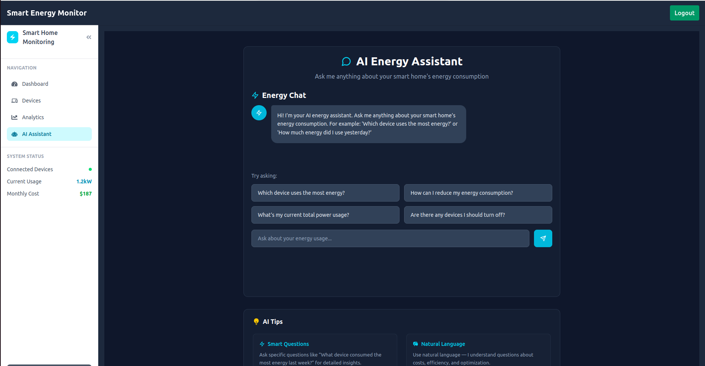
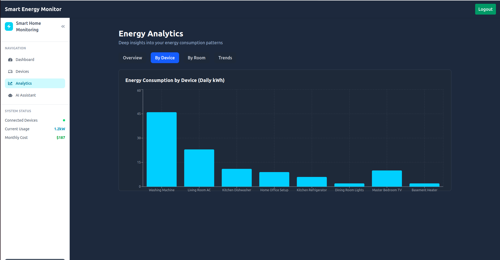
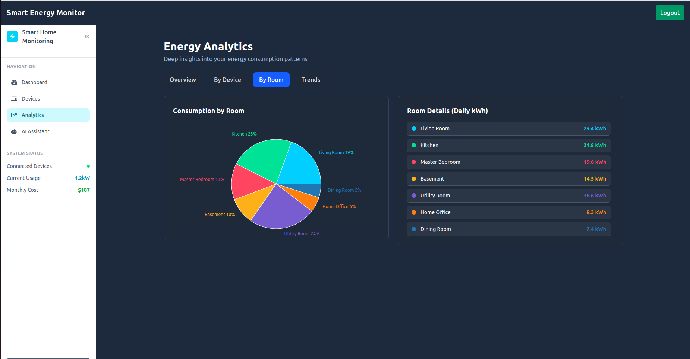
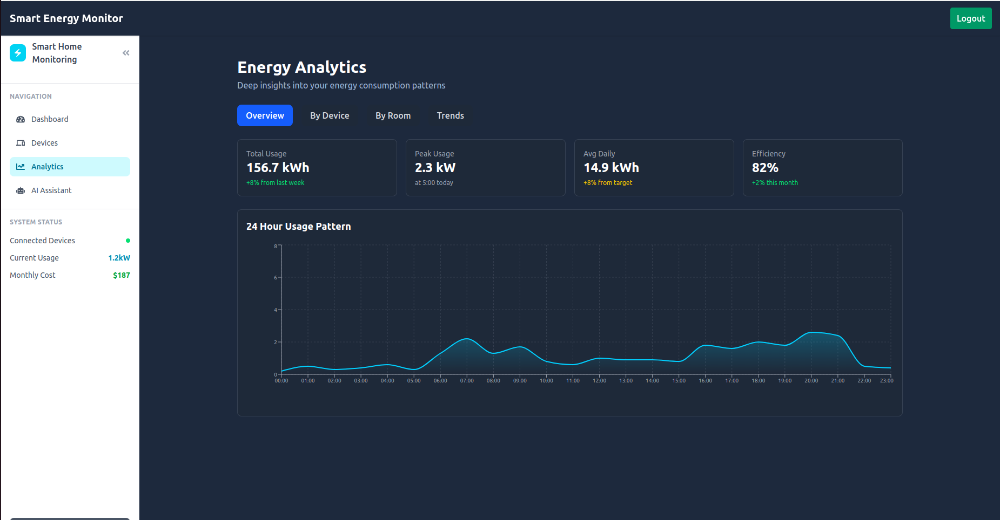
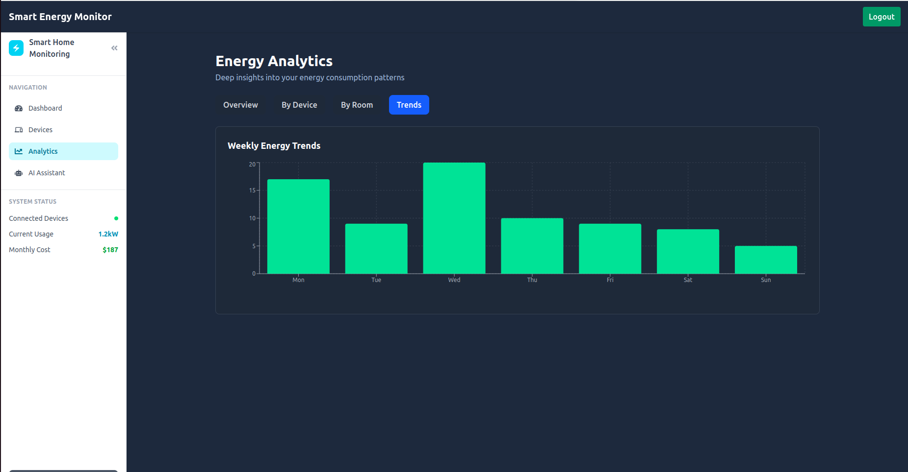
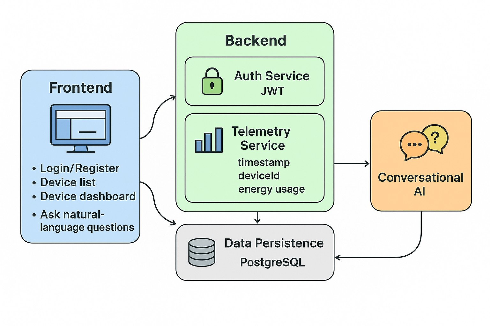
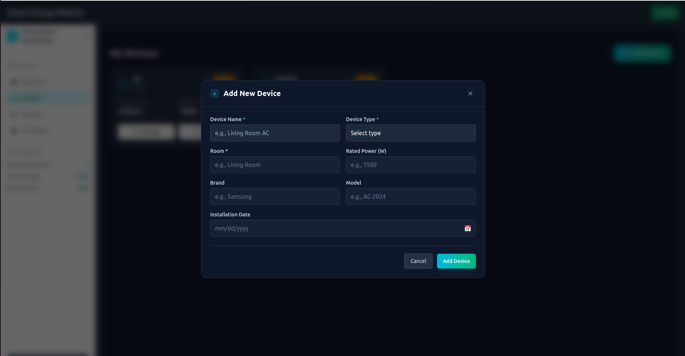
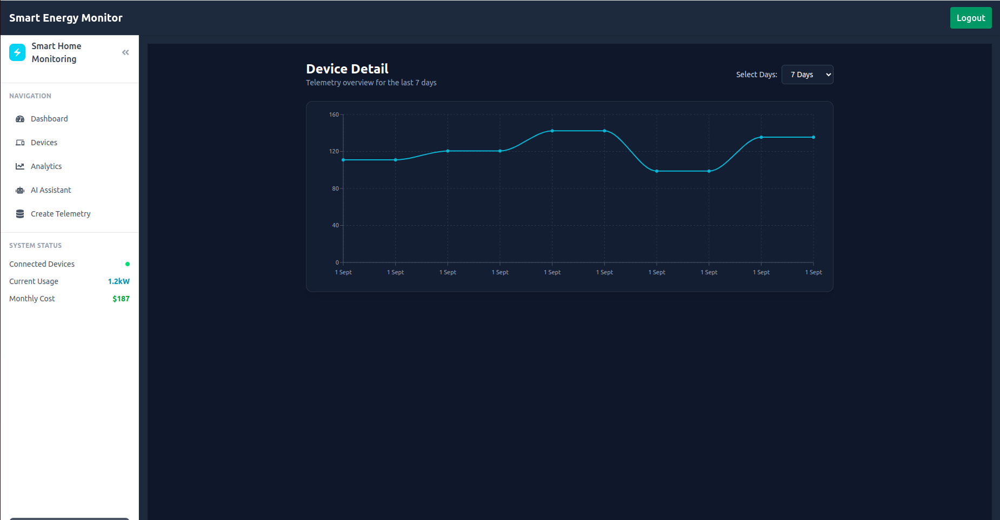
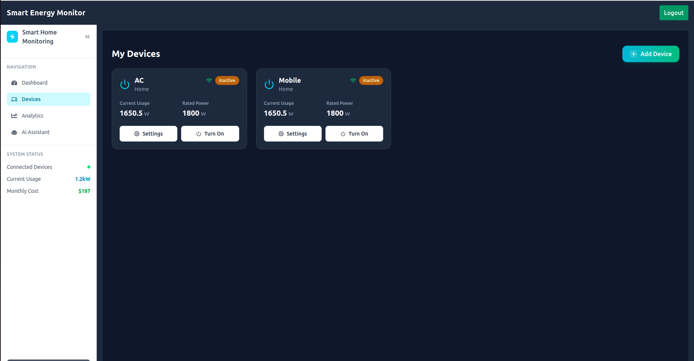
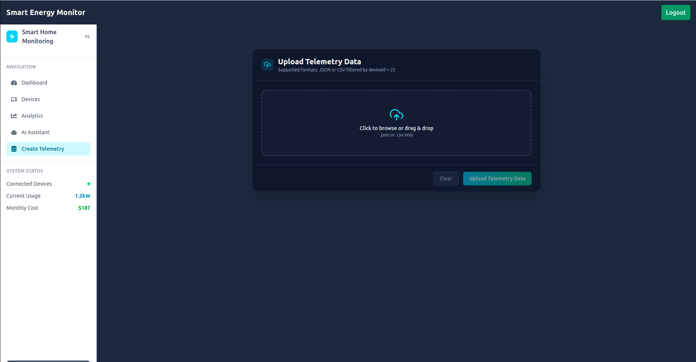

# 🔋 Smart Home Energy Monitoring System – Frontend

## This is the frontend SPA for the Smart Home Energy Monitoring System. It provides a modern, responsive UI for user authentication, energy usage visualization, and interacting with the AI chatbot to ask natural-language questions.

🖥️ Tech Stack

## Vite + React

## TypeScript

## Tailwind CSS

## Axios

## Charting Library (Chart.js)

🌐 Features
Single-page application (SPA) in **Vite + React**, including:

- 🔐 User Auth: Login & registration screens
- 📱 Device List: View all registered energy-consuming devices
- 📈 Dashboard: Visual energy insights with 7-day usage chart
- 💬 AI Chatbot: Ask questions

## 📁 Project Structure

```
├── frontend/
│   ├── .env
│   ├── package.json
│   └── src/
│       ├── assets/
│       ├── components/
│       ├── context/
│       ├── pages/
│       ├── schemas/
│       ├── services/
│       ├── types/
│       ├── App.tsx
│       └── main.tsx
├── README.md
```

## ⚙️ Environment Variables

````env.example

VITE_AUTH_API=http://your-auth-service-url/api/v1
VITE_DEVICE_API=http://your-device-service-url/api/v1
VITE_CHATBOT_API=http://your-chatbot-service-url/api/v1

---

## Running the App

```Install dependencies

 -  pnpm install

```Start the  server

 - pnpm run dev


```Testing

 - pnpm test


## 📜 License

MIT
````

## ⚙️ Screenshots

### AI & Analytics







### Architecture & Devices







### Auth & Telemetry


